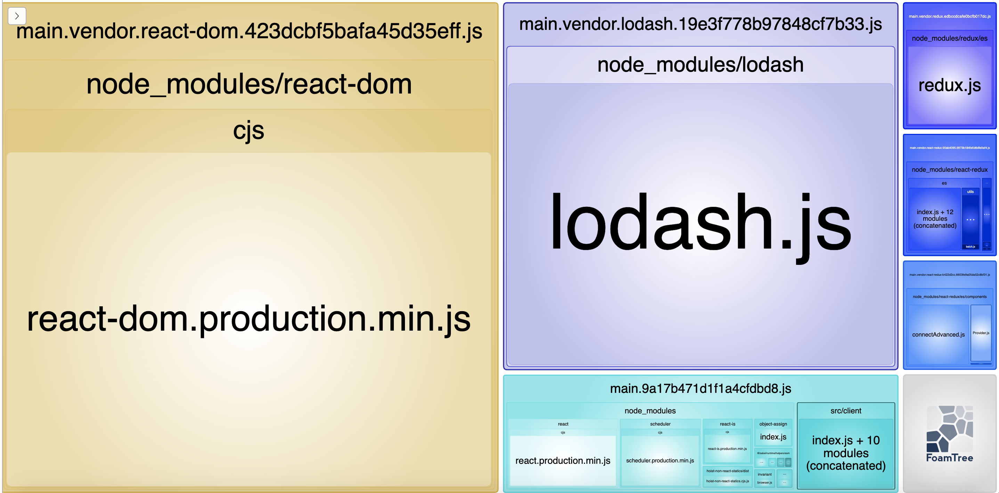
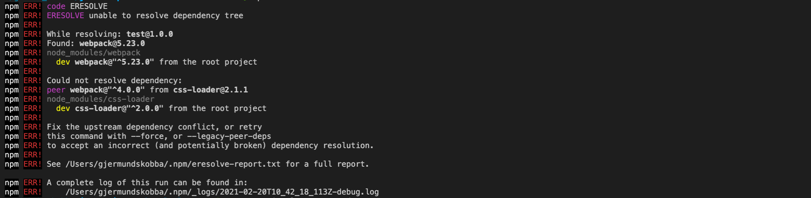

# Analysis of npm packages


## npm audit
18 vulnerabilities (8 low, 2 moderate, 8 high)

## npx npm-check-updates
```
express                                  ^4.16.3  →   ^4.17.1
immutability-helper                        2.8.1  →     3.1.1
lodash                                   4.17.11  →   4.17.20
prop-types                                15.6.2  →    15.7.2
react                                    16.13.1  →    17.0.1
react-dom                                16.13.1  →    17.0.1
react-redux                                7.1.0  →     7.2.2
redux                                     ^4.0.1  →    ^4.0.5
@babel/core                               ^7.0.0  →  ^7.12.17
@babel/plugin-proposal-class-properties   ^7.0.0  →  ^7.12.13
@babel/preset-env                         ^7.0.0  →  ^7.12.17
@babel/preset-react                       ^7.0.0  →  ^7.12.13
babel-loader                              ^8.0.0  →    ^8.2.2
clean-webpack-plugin                      ^1.0.0  →    ^3.0.0
concurrently                              ^4.0.0  →    ^5.3.0
css-loader                                ^2.0.0  →    ^5.0.2
file-loader                               ^3.0.0  →    ^6.2.0
html-webpack-plugin                       ^3.2.0  →    ^5.2.0
nodemon                                  ^1.17.3  →    ^2.0.7
style-loader                             ^0.23.0  →    ^2.0.0
url-loader                                ^1.0.1  →    ^4.1.1
webpack                                   ^4.5.0  →   ^5.23.0
webpack-cli                               ^3.0.8  →    ^4.5.0
webpack-dev-server                        ^3.1.3  →   ^3.11.2
```
# Updating webpack
## npm
```
npm i -D webpack@latest
npm i -D webpack-cli/serve@latest
npm i -D webpack-dev-server@latest

npm i -D webpack-merge

npm i -D html-webpack-plugin@latest
npm i -D clean-webpack-plugin@latest
```

## Changing file structure
* Removing backend from repo
* Using only webpack for hot-reload, so removing nodemon and concurrently
```
npm remove nodemon concurrently
```

## Adding Bundle Analyser
Why do we need webpack-cli for webpack 5? Did they not update their deps?

```
npm i -D webpack-bundle-analyzer webpack-cli
```

## Startup scirpts
Before
```
  "scripts": {
    "build": "webpack --mode production",
    "start": "npm run build && node src/server/index.js",
    "client": "webpack-dev-server --mode development --devtool inline-source-map --hot",
    "server": "nodemon src/server/index.js",
    "dev": "concurrently \"npm run server\" \"npm run client\""
  }
```

After
```
  "scripts": {
    "start": "webpack serve --config webpack/dev.config.js",
    "build": "webpack --config webpack/dev.config.js",
    "stats": "webpack --config webpack/stats.config.js"
  }
```

## Running stats



## Checking packages
Running "npm i" and getting:
6 vulnerabilities (4 low, 2 high)

Removing "node_modules" and "package-lock.json":
```
rm -rf node_modules ; rm package-lock.json
```

Running "npm i" again getting:


Observing the notorious "css-loader" package.

Installing again with:
```
npm i --legacy-peer-deps
```

I´m in a state where "npm i" requires the "package-lock-json" to run!!

### Remove Unused Backed code and restructure folders
Just some restructure to prefered layout.

# Remove unused packages
```
npm remove express prop-types immutability-helper babel-polyfill
npm remove file-loader css-loader style-loader url-loader
```

